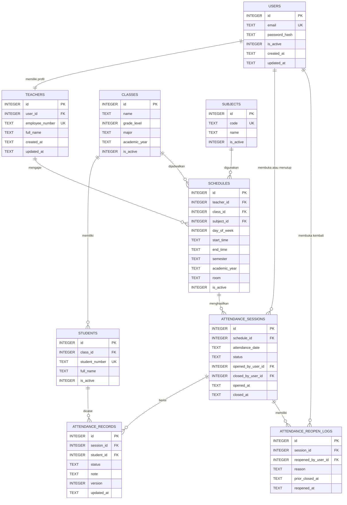

# Database Schema dan ERD Hadiruna

## Aplikasi Absensi Siswa untuk SMA Islam dan Madrasah Aliyah

| Informasi | Keterangan |
|---|---|
| Dokumen | Database Schema dan Entity Relationship Diagram |
| Produk | Hadiruna *(nama sementara)* |
| Database | SQLite 3 |
| Acuan | Mini PRD, Sitemap, User Flow, dan UI Style Guide Hadiruna v1.0 |
| File implementasi | `schema-hadiruna.sql` |
| Versi dokumen | 1.0 |
| Tanggal | 8 September 2026 |

## 1. Tujuan

Dokumen ini menerjemahkan kebutuhan prototype Hadiruna menjadi model data relasional yang dapat digunakan oleh backend Hono.js. Desain berfokus pada satu aktor, yaitu guru, dan mendukung jadwal mengajar, daftar siswa, sesi absensi, autosave status kehadiran, penutupan sesi, serta pembukaan kembali dengan alasan.

Struktur sengaja tidak mencakup panel admin, orang tua, absensi mandiri siswa, notifikasi, rekap semester kompleks, atau multi-sekolah.

## 2. Keputusan Desain Utama

### 2.1 Status “Belum Dibuka” Tidak Disimpan

Sebuah jadwal dianggap **Belum Dibuka** apabila belum ada baris pada `attendance_sessions` untuk kombinasi jadwal dan tanggal tersebut. Karena itu, `attendance_sessions.status` hanya memiliki:

- `open` → label UI **Dibuka**;
- `closed` → label UI **Ditutup**.

Keputusan ini menghindari pembuatan sesi kosong untuk seluruh jadwal sebelum guru benar-benar memulai absensi.

### 2.2 Daftar Kehadiran Dibuat Saat Sesi Dibuka

Ketika guru membuka absensi, backend menjalankan satu transaksi:

1. memeriksa kepemilikan jadwal;
2. memastikan sesi untuk jadwal dan tanggal belum ada;
3. membuat `attendance_sessions` berstatus `open`; dan
4. membuat satu `attendance_records` berstatus `present` untuk setiap siswa aktif dalam kelas.

Jika salah satu langkah gagal, seluruh transaksi dibatalkan.

### 2.3 Pembukaan Kembali Memiliki Log

Ketika sesi dibuka kembali:

1. baris baru dibuat pada `attendance_reopen_logs`;
2. waktu penutupan sebelumnya disalin ke `prior_closed_at`;
3. `attendance_sessions.status` diubah dari `closed` menjadi `open`; dan
4. `closed_at` serta `closed_by_user_id` dikosongkan.

Ketika guru menutup kembali sesi, `closed_at` dan `closed_by_user_id` diisi dengan nilai terbaru. Log sebelumnya tetap tersimpan.

### 2.4 Autosave Menggunakan Version Number

Setiap `attendance_records` memiliki kolom `version`. Backend memperbarui catatan menggunakan pola optimistic concurrency:

```sql
UPDATE attendance_records
SET status = ?,
    note = ?,
    version = version + 1,
    updated_at = strftime('%Y-%m-%dT%H:%M:%fZ', 'now')
WHERE id = ?
  AND version = ?;
```

Jika tidak ada baris yang berubah, data di layar sudah tertinggal dari versi database. Backend mengembalikan konflik agar frontend memuat ulang catatan terbaru, bukan menimpa perubahan secara diam-diam.

### 2.5 Bahasa Database dan UI Dipisahkan

Nilai database menggunakan istilah teknis berbahasa Inggris, sedangkan UI menggunakan bahasa Indonesia:

| Database | Label UI |
|---|---|
| `present` | Hadir |
| `excused` | Izin |
| `sick` | Sakit |
| `absent` | Alpa |
| `late` | Terlambat |
| `open` | Dibuka |
| `closed` | Ditutup |

## 3. ERD



Keterangan: `PK` adalah primary key, `FK` adalah foreign key, dan `UK` adalah unique key.

## 4. Ringkasan Entitas

| Tabel | Tujuan | Data Utama |
|---|---|---|
| `users` | Autentikasi guru | Email, password hash, status akun |
| `teachers` | Profil guru | Nama dan nomor pegawai |
| `classes` | Identitas kelas | Nama, tingkat, jurusan, tahun ajaran |
| `subjects` | Mata pelajaran | Kode dan nama pelajaran |
| `students` | Daftar siswa | Nomor induk, nama, dan kelas |
| `schedules` | Jadwal mengajar berulang | Guru, kelas, mata pelajaran, hari, jam |
| `attendance_sessions` | Sesi absensi per tanggal | Jadwal, tanggal, status, waktu buka/tutup |
| `attendance_records` | Kehadiran setiap siswa | Status, catatan, dan versi autosave |
| `attendance_reopen_logs` | Riwayat pembukaan kembali | Alasan, waktu, pelaku, penutupan sebelumnya |

## 5. Detail Tabel

### 5.1 `users`

Menyimpan kredensial untuk login. Prototype hanya memiliki pengguna guru sehingga role tidak diperlukan pada versi ini; keberadaan profil `teachers` menandakan akun guru.

| Kolom | Tipe | Null | Constraint | Keterangan |
|---|---|---:|---|---|
| `id` | INTEGER | Tidak | PK, autoincrement | ID akun |
| `email` | TEXT | Tidak | Unique, `COLLATE NOCASE` | Email login tanpa membedakan kapital |
| `password_hash` | TEXT | Tidak | Min. 20 karakter | Hasil hashing kata sandi |
| `is_active` | INTEGER | Tidak | 0 atau 1 | Status akun |
| `created_at` | TEXT | Tidak | Default waktu UTC | Waktu dibuat |
| `updated_at` | TEXT | Tidak | Default waktu UTC | Waktu perubahan terakhir |

Kata sandi asli tidak pernah disimpan. Algoritma hashing dan pengelolaan sesi ditentukan pada implementasi backend/API.

### 5.2 `teachers`

Memisahkan profil guru dari kredensial login.

| Kolom | Tipe | Null | Constraint | Keterangan |
|---|---|---:|---|---|
| `id` | INTEGER | Tidak | PK | ID guru |
| `user_id` | INTEGER | Tidak | FK, unique | Satu akun memiliki satu profil guru |
| `employee_number` | TEXT | Ya | Unique | NIP/NUPTK/nomor internal |
| `full_name` | TEXT | Tidak | 2–120 karakter | Nama guru |
| `created_at` | TEXT | Tidak | Default UTC | Waktu dibuat |
| `updated_at` | TEXT | Tidak | Default UTC | Waktu perubahan |

### 5.3 `classes`

Menyimpan kelas untuk satu tahun ajaran.

| Kolom | Tipe | Null | Constraint | Keterangan |
|---|---|---:|---|---|
| `id` | INTEGER | Tidak | PK | ID kelas |
| `name` | TEXT | Tidak | Unique bersama tahun ajaran | Contoh: XI IPA 2 |
| `grade_level` | INTEGER | Tidak | 10–12 | Tingkat SMA/MA |
| `major` | TEXT | Ya | 1–60 karakter | Contoh: IPA, IPS, Keagamaan |
| `academic_year` | TEXT | Tidak | 7–20 karakter | Contoh: 2026/2027 |
| `is_active` | INTEGER | Tidak | 0 atau 1 | Status kelas |
| `created_at` | TEXT | Tidak | Default UTC | Waktu dibuat |
| `updated_at` | TEXT | Tidak | Default UTC | Waktu perubahan |

### 5.4 `subjects`

Menyimpan mata pelajaran umum maupun keislaman.

| Kolom | Tipe | Null | Constraint | Keterangan |
|---|---|---:|---|---|
| `id` | INTEGER | Tidak | PK | ID mata pelajaran |
| `code` | TEXT | Tidak | Unique, case-insensitive | Contoh: INF, FQH, AQH |
| `name` | TEXT | Tidak | 2–100 karakter | Contoh: Informatika, Fikih |
| `is_active` | INTEGER | Tidak | 0 atau 1 | Status mata pelajaran |
| `created_at` | TEXT | Tidak | Default UTC | Waktu dibuat |
| `updated_at` | TEXT | Tidak | Default UTC | Waktu perubahan |

### 5.5 `students`

Menyimpan siswa dan kelas aktifnya.

| Kolom | Tipe | Null | Constraint | Keterangan |
|---|---|---:|---|---|
| `id` | INTEGER | Tidak | PK | ID siswa |
| `class_id` | INTEGER | Tidak | FK → `classes.id` | Kelas siswa |
| `student_number` | TEXT | Tidak | Unique, case-insensitive | NIS/nomor induk |
| `full_name` | TEXT | Tidak | 2–120 karakter | Nama siswa |
| `is_active` | INTEGER | Tidak | 0 atau 1 | Dipakai saat membuat sesi |
| `created_at` | TEXT | Tidak | Default UTC | Waktu dibuat |
| `updated_at` | TEXT | Tidak | Default UTC | Waktu perubahan |

Versi prototype menganggap siswa tidak berpindah kelas selama periode demo. Jika dikembangkan menjadi sistem operasional, hubungan siswa–kelas sebaiknya dipisahkan menjadi tabel enrollment per tahun ajaran.

### 5.6 `schedules`

Menyimpan jadwal mingguan. `day_of_week` menggunakan ISO-8601: Senin = 1 sampai Minggu = 7.

| Kolom | Tipe | Null | Constraint | Keterangan |
|---|---|---:|---|---|
| `id` | INTEGER | Tidak | PK | ID jadwal |
| `teacher_id` | INTEGER | Tidak | FK → `teachers.id` | Guru pengajar |
| `class_id` | INTEGER | Tidak | FK → `classes.id` | Kelas |
| `subject_id` | INTEGER | Tidak | FK → `subjects.id` | Mata pelajaran |
| `day_of_week` | INTEGER | Tidak | 1–7 | Hari mingguan |
| `start_time` | TEXT | Tidak | Format HH:MM | Jam mulai |
| `end_time` | TEXT | Tidak | Format HH:MM, setelah mulai | Jam selesai |
| `semester` | TEXT | Tidak | `odd` atau `even` | Semester ganjil/genap |
| `academic_year` | TEXT | Tidak | 7–20 karakter | Tahun ajaran |
| `room` | TEXT | Ya | Maks. 60 karakter | Ruangan |
| `is_active` | INTEGER | Tidak | 0 atau 1 | Status jadwal |
| `created_at` | TEXT | Tidak | Default UTC | Waktu dibuat |
| `updated_at` | TEXT | Tidak | Default UTC | Waktu perubahan |

### 5.7 `attendance_sessions`

Menyimpan satu sesi untuk satu jadwal pada satu tanggal.

| Kolom | Tipe | Null | Constraint | Keterangan |
|---|---|---:|---|---|
| `id` | INTEGER | Tidak | PK | ID sesi |
| `schedule_id` | INTEGER | Tidak | FK, unique bersama tanggal | Jadwal sumber |
| `attendance_date` | TEXT | Tidak | YYYY-MM-DD | Tanggal absensi lokal sekolah |
| `status` | TEXT | Tidak | `open` atau `closed` | Status terkini |
| `opened_by_user_id` | INTEGER | Tidak | FK → `users.id` | Akun pembuka |
| `closed_by_user_id` | INTEGER | Ya | FK → `users.id` | Akun penutup terakhir |
| `opened_at` | TEXT | Tidak | UTC timestamp | Waktu pertama dibuka |
| `closed_at` | TEXT | Ya | UTC timestamp | Waktu penutupan terbaru |
| `created_at` | TEXT | Tidak | UTC timestamp | Waktu dibuat |
| `updated_at` | TEXT | Tidak | UTC timestamp | Waktu perubahan |

Constraint memastikan:

- kombinasi `schedule_id + attendance_date` unik;
- sesi `open` tidak memiliki `closed_at` dan `closed_by_user_id`; serta
- sesi `closed` wajib memiliki keduanya.

Tanggal absensi menggunakan tanggal lokal sekolah, sedangkan timestamp kejadian disimpan dalam UTC.

### 5.8 `attendance_records`

Menyimpan satu catatan kehadiran per siswa dalam satu sesi.

| Kolom | Tipe | Null | Constraint | Keterangan |
|---|---|---:|---|---|
| `id` | INTEGER | Tidak | PK | ID catatan |
| `session_id` | INTEGER | Tidak | FK, unique bersama siswa | Sesi absensi |
| `student_id` | INTEGER | Tidak | FK, unique bersama sesi | Siswa |
| `status` | TEXT | Tidak | Lima nilai yang diizinkan | Status kehadiran |
| `note` | TEXT | Ya | Maks. 500 karakter | Catatan opsional |
| `version` | INTEGER | Tidak | Minimal 1 | Optimistic concurrency autosave |
| `created_at` | TEXT | Tidak | UTC timestamp | Waktu dibuat |
| `updated_at` | TEXT | Tidak | UTC timestamp | Waktu autosave terakhir |

Kombinasi `session_id + student_id` unik agar satu siswa tidak memiliki dua status dalam sesi yang sama.

### 5.9 `attendance_reopen_logs`

Menyimpan setiap kejadian pembukaan kembali agar alasan lama tidak hilang ketika sesi dibuka berkali-kali.

| Kolom | Tipe | Null | Constraint | Keterangan |
|---|---|---:|---|---|
| `id` | INTEGER | Tidak | PK | ID log |
| `session_id` | INTEGER | Tidak | FK → sesi | Sesi terkait |
| `reopened_by_user_id` | INTEGER | Tidak | FK → pengguna | Akun pelaku |
| `reason` | TEXT | Tidak | 10–250 karakter | Alasan pembukaan kembali |
| `prior_closed_at` | TEXT | Tidak | UTC timestamp | Waktu penutupan sebelum dibuka |
| `reopened_at` | TEXT | Tidak | Default UTC | Waktu dibuka kembali |

## 6. Kardinalitas Relasi

| Relasi | Kardinalitas | Penjelasan |
|---|---|---|
| `users` → `teachers` | 1 : 1 | Satu akun demo mewakili satu guru |
| `teachers` → `schedules` | 1 : N | Guru memiliki banyak jadwal |
| `classes` → `students` | 1 : N | Kelas memiliki banyak siswa |
| `classes` → `schedules` | 1 : N | Kelas dapat memiliki banyak jadwal |
| `subjects` → `schedules` | 1 : N | Mata pelajaran muncul pada banyak jadwal |
| `schedules` → `attendance_sessions` | 1 : N | Jadwal menghasilkan sesi pada tanggal berbeda |
| `attendance_sessions` → `attendance_records` | 1 : N | Sesi berisi kehadiran banyak siswa |
| `students` → `attendance_records` | 1 : N | Siswa memiliki catatan di banyak sesi |
| `attendance_sessions` → `attendance_reopen_logs` | 1 : N | Sesi dapat dibuka kembali beberapa kali |
| `users` → sesi/log | 1 : N | Akun mencatat tindakan buka, tutup, dan buka kembali |

## 7. Constraint dan Integritas Data

### Unique Constraint

| Constraint | Tujuan |
|---|---|
| `users.email` | Mencegah akun login ganda |
| `teachers.user_id` | Menjaga relasi akun–guru satu banding satu |
| `students.student_number` | Mencegah nomor induk ganda |
| `classes(name, academic_year)` | Mencegah kelas ganda pada tahun yang sama |
| Kombinasi kolom jadwal | Mencegah jadwal identik tersimpan dua kali |
| `attendance_sessions(schedule_id, attendance_date)` | Mencegah sesi ganda |
| `attendance_records(session_id, student_id)` | Mencegah status siswa ganda |

### Check Constraint

- Tingkat kelas hanya 10–12.
- Hari hanya 1–7.
- Waktu menggunakan format 24 jam `HH:MM`.
- Jam selesai harus setelah jam mulai.
- Boolean SQLite hanya 0 atau 1.
- Status sesi dan kehadiran dibatasi ke nilai yang ditentukan.
- Alasan pembukaan kembali memiliki 10–250 karakter.
- Catatan siswa maksimal 500 karakter.

### Foreign Key Action

- Data master memakai `ON DELETE RESTRICT` agar histori tidak terhapus tidak sengaja.
- Catatan kehadiran dan log menggunakan `ON DELETE CASCADE` dari sesi.
- Foreign key harus diaktifkan pada setiap koneksi SQLite melalui `PRAGMA foreign_keys = ON`.

## 8. Index

| Index | Kegunaan |
|---|---|
| `idx_students_class_active` | Memuat siswa aktif berdasarkan kelas |
| `idx_schedules_teacher_day_active` | Memuat jadwal harian guru |
| `idx_schedules_class` | Mencari jadwal berdasarkan kelas |
| `idx_attendance_sessions_status_date` | Filter riwayat berdasarkan status/tanggal |
| `idx_attendance_records_session_status` | Menghitung ringkasan kehadiran |
| `idx_attendance_records_student` | Melacak kehadiran siswa |
| `idx_attendance_reopen_logs_session_time` | Mengambil riwayat buka kembali terbaru |

SQLite otomatis membuat index untuk unique constraint, termasuk pencarian sesi berdasarkan `schedule_id + attendance_date`. Karena itu, schema tidak membuat index eksplisit kedua untuk kombinasi yang sama.

## 9. View

### `v_schedule_details`

Menggabungkan jadwal dengan guru, kelas, dan mata pelajaran. View ini membantu endpoint Dashboard dan Detail Jadwal.

### `v_attendance_summary`

Menghasilkan:

- jumlah total siswa;
- jumlah Hadir;
- jumlah Izin;
- jumlah Sakit;
- jumlah Alpa;
- jumlah Terlambat; dan
- persentase kehadiran.

Sesuai Mini PRD, persentase dihitung sebagai:

$$
\text{Persentase Kehadiran} =
\frac{\text{Jumlah status present}}{\text{Total siswa dalam sesi}}
\times 100\%
$$

Status `late` ditampilkan terpisah dan tidak masuk pembilang pada versi prototype.

## 10. Transaksi Utama

### Membuka Sesi

```sql
BEGIN IMMEDIATE;

-- 1. Verifikasi jadwal dan kepemilikan pada backend.
-- 2. Buat attendance_sessions.
-- 3. Salin seluruh siswa aktif menjadi attendance_records status present.

COMMIT;
```

Unique constraint memastikan dua permintaan bersamaan tidak membuat sesi ganda.

### Menutup Sesi

Dalam satu transaksi:

1. pastikan sesi masih `open`;
2. pastikan tidak ada autosave yang tertinggal pada frontend;
3. hitung ulang ringkasan dari database;
4. ubah status menjadi `closed`;
5. isi `closed_by_user_id` dan `closed_at`; dan
6. perbarui `updated_at`.

### Membuka Kembali

Dalam satu transaksi:

1. pastikan sesi masih `closed`;
2. validasi alasan;
3. simpan log beserta `prior_closed_at`;
4. ubah status menjadi `open`;
5. kosongkan `closed_by_user_id` dan `closed_at`; dan
6. perbarui `updated_at`.

## 11. Query Utama yang Didukung

| Kebutuhan Halaman | Query/Data |
|---|---|
| Login | `users` + `teachers` berdasarkan email |
| Dashboard | `v_schedule_details` + left join sesi pada tanggal terpilih |
| Detail Jadwal | View jadwal + jumlah siswa aktif dalam kelas |
| Buka Absensi | Insert sesi dan insert-select siswa aktif |
| Sesi Absensi | Sesi + record + siswa, urut nama |
| Autosave | Update record berdasarkan `id` dan `version` |
| Hasil Absensi | `v_attendance_summary` + record non-present |
| Buka Kembali | Insert log + update sesi dalam transaksi |
| Riwayat | Sesi + view jadwal + view ringkasan berdasarkan guru |

## 12. Aturan yang Ditegakkan Backend

Tidak semua aturan dapat diekspresikan secara aman hanya dengan constraint SQLite. Backend wajib memastikan:

- akun yang login adalah pemilik jadwal;
- siswa yang dimasukkan ke record berasal dari kelas jadwal;
- record hanya diubah ketika sesi `open`;
- penutupan hanya dilakukan oleh pemilik sesi;
- jumlah record sesuai dengan daftar siswa yang dibuat saat pembukaan;
- alasan reopen tervalidasi sebelum transaksi;
- `updated_at` diubah pada setiap update; dan
- autosave menggunakan `version` terkini.

## 13. Konvensi Waktu

- `attendance_date` memakai tanggal lokal sekolah dalam format `YYYY-MM-DD`.
- Semua timestamp kejadian memakai UTC ISO-8601, misalnya `2026-09-08T03:15:20.123Z`.
- Backend bertanggung jawab mengubah waktu UTC menjadi zona waktu sekolah ketika ditampilkan.
- `start_time` dan `end_time` merupakan jam lokal sekolah dalam format `HH:MM`.

Pemisahan ini menghindari perubahan tanggal absensi akibat konversi zona waktu.

## 14. Kebijakan Penghapusan

Prototype tidak menyediakan fitur hapus melalui UI. Data master menggunakan flag `is_active` agar akun, siswa, kelas, mata pelajaran, atau jadwal dapat dinonaktifkan tanpa menghilangkan histori.

Jika data dihapus langsung melalui database:

- penghapusan master yang masih digunakan akan ditolak;
- penghapusan sesi akan menghapus record dan reopen log terkait; dan
- tindakan penghapusan sebaiknya hanya dilakukan pada database demo yang dapat dipulihkan.

## 15. Data Seed yang Direkomendasikan

File schema tidak memasukkan data seed agar struktur dapat digunakan tanpa data contoh yang tidak diinginkan. Untuk demo, buat file seed terpisah yang memuat:

- 2 akun dan profil guru;
- 2–3 kelas;
- 2–3 mata pelajaran umum/keislaman;
- 15–25 siswa per kelas;
- 3–4 jadwal pada hari demo;
- satu sesi `open`;
- satu sesi `closed`; dan
- beberapa variasi status kehadiran.

Semua identitas siswa harus fiktif.

## 16. Urutan Pembuatan Tabel

Urutan pada file SQL sudah mengikuti dependensi foreign key:

1. `users`
2. `teachers`
3. `classes`
4. `subjects`
5. `students`
6. `schedules`
7. `attendance_sessions`
8. `attendance_records`
9. `attendance_reopen_logs`
10. index dan view

## 17. Cara Menjalankan

Menggunakan SQLite CLI:

```bash
sqlite3 hadiruna.db < schema-hadiruna.sql
```

Memeriksa hasil:

```bash
sqlite3 hadiruna.db ".tables"
sqlite3 hadiruna.db ".schema attendance_sessions"
sqlite3 hadiruna.db "PRAGMA foreign_key_check;"
```

File dapat dijalankan kembali karena menggunakan `IF NOT EXISTS`, tetapi perubahan versi schema selanjutnya sebaiknya menggunakan migration terpisah.

## 18. Checklist Validasi

- [ ] `PRAGMA foreign_keys` aktif pada koneksi aplikasi.
- [ ] Seluruh tabel dibuat tanpa error.
- [ ] Seluruh foreign key valid.
- [ ] Email tidak membedakan huruf kapital.
- [ ] Satu akun hanya memiliki satu profil guru.
- [ ] Satu jadwal tidak membuat dua sesi pada tanggal yang sama.
- [ ] Satu siswa hanya memiliki satu record dalam satu sesi.
- [ ] Status di luar daftar yang ditentukan ditolak.
- [ ] Sesi `closed` wajib memiliki waktu dan pengguna penutup.
- [ ] Sesi `open` tidak memiliki data penutupan aktif.
- [ ] Alasan reopen di luar panjang 10–250 karakter ditolak.
- [ ] Ringkasan menghitung lima status dengan benar.
- [ ] Persentase hanya menghitung `present` sebagai pembilang.
- [ ] Optimistic concurrency mencegah autosave lama menimpa versi baru.
- [ ] Query jadwal, daftar siswa, ringkasan, dan riwayat memiliki index pendukung.
- [ ] Schema dapat dijalankan dua kali tanpa gagal.

## 19. Handoff ke API Contract

API Contract berikutnya perlu menggunakan:

- resource `auth`, `schedules`, `attendance-sessions`, dan `attendance-records`;
- validasi status sesuai check constraint;
- transaksi untuk buka, tutup, dan buka kembali;
- respons konflik untuk version mismatch autosave;
- otorisasi berdasarkan relasi `users → teachers → schedules`; dan
- pemetaan nilai database ke label UI.

---

Schema ini menjaga database Hadiruna tetap kecil tetapi cukup kuat untuk skenario demo: login guru, jadwal harian, absensi dengan autosave, ringkasan, penguncian sesi, dan koreksi yang tercatat.
