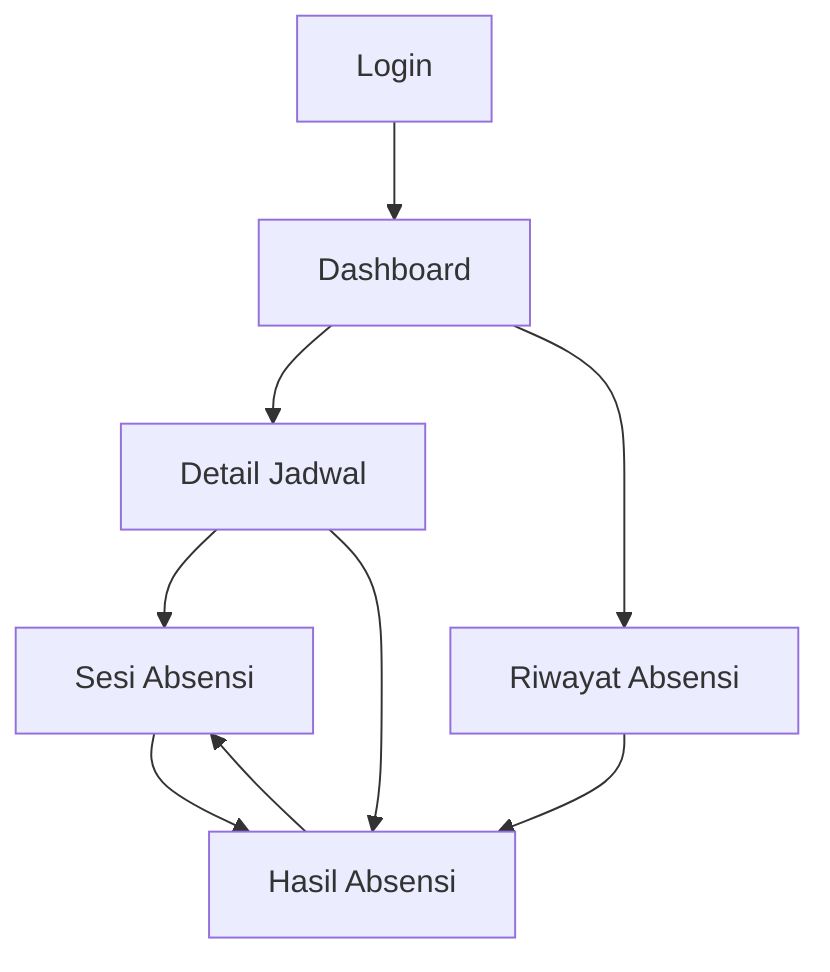

# Sitemap Hadiruna

## Aplikasi Absensi Siswa untuk SMA Islam dan Madrasah Aliyah

| Informasi | Keterangan |
|---|---|
| Dokumen | Sitemap / Struktur Informasi |
| Produk | Hadiruna *(nama sementara)* |
| Pengguna | Guru |
| Platform | Web responsif |
| Acuan | Mini PRD Hadiruna v1.0 |
| Versi dokumen | 1.0 |
| Tanggal | 8 September 2026 |

## 1. Tujuan Sitemap

Sitemap ini menetapkan struktur halaman prototype Hadiruna dan hubungan navigasi di antara halaman tersebut. Struktur dibuat sesingkat mungkin agar guru dapat berpindah dari jadwal ke proses absensi tanpa navigasi yang rumit.

Sitemap hanya mencakup area guru. Panel admin, pengelolaan data master, rekap semester, dan fitur siswa tidak dimasukkan karena berada di luar ruang lingkup prototype.

## 2. Prinsip Struktur Informasi

1. **Berpusat pada jadwal:** absensi selalu dimulai dari jadwal mengajar guru.
2. **Aksi utama mudah ditemukan:** dashboard langsung menampilkan jadwal dan tombol tindakan yang sesuai.
3. **Halaman minimum:** satu halaman memiliki satu tujuan utama dan tidak ada menu yang belum dibutuhkan.
4. **Status menentukan tindakan:** jadwal yang belum dibuka, sedang dibuka, dan telah ditutup mengarahkan guru ke tindakan berbeda.
5. **Konsisten di desktop dan mobile:** hierarki informasi tetap sama pada semua ukuran layar.

## 3. Struktur Sitemap Utama

Keterangan hubungan:

- Dashboard menjadi halaman utama setelah guru berhasil masuk.
- Detail Jadwal menjadi pintu masuk untuk membuka, melanjutkan, atau melihat hasil absensi.
- Sesi Absensi digunakan hanya ketika sesi berstatus **Dibuka**.
- Hasil Absensi digunakan ketika sesi berstatus **Ditutup**.
- Riwayat Absensi mengarahkan guru ke hasil sesi yang pernah dilakukan.
- Dari Hasil Absensi, guru dapat membuka kembali sesi dan kembali ke Sesi Absensi.

## 4. Hierarki Halaman

| Area | Halaman | Bagian Utama |
|---|---|---|
| Publik | Login | Identitas aplikasi, formulir login, pesan kesalahan |
| Guru | Dashboard | Ringkasan hari ini, jadwal hari ini, tindakan cepat |
| Guru | Detail Jadwal | Informasi jadwal, informasi kelas, pratinjau siswa, tindakan sesi |
| Guru | Sesi Absensi | Ringkasan kehadiran, pencarian, daftar siswa, tutup absensi |
| Guru | Hasil Absensi | Statistik, daftar ketidakhadiran, informasi perubahan, buka kembali |
| Guru | Riwayat Absensi | Daftar sesi sebelumnya, filter sederhana, tautan menuju sesi atau hasil |

## 5. Daftar Halaman dan Route

| ID | Halaman | Route Frontend | Akses | Tujuan Utama |
|---|---|---|---|---|
| PG-01 | Login | `/login` | Publik | Memverifikasi akun guru |
| PG-02 | Dashboard | `/dashboard` | Guru | Menampilkan jadwal dan aktivitas hari ini |
| PG-03 | Detail Jadwal | `/schedules/:scheduleId` | Guru | Menampilkan konteks jadwal dan tindakan absensi |
| PG-04 | Sesi Absensi | `/attendance/:sessionId` | Guru | Mengisi kehadiran ketika sesi dibuka |
| PG-05 | Hasil Absensi | `/attendance/:sessionId/result` | Guru | Menampilkan hasil sesi yang telah ditutup |
| PG-06 | Riwayat Absensi | `/history` | Guru | Menampilkan sesi absensi yang pernah dilakukan |
| PG-07 | Halaman Tidak Ditemukan | `*` | Publik/Guru | Menangani alamat halaman yang tidak valid |

Route API tidak dibahas dalam sitemap dan akan ditentukan pada dokumen API Contract.

## 6. Detail Konten Setiap Halaman

### PG-01 — Login

**Tujuan:** memungkinkan guru masuk ke area aplikasi.

Konten utama:

- logo dan nama Hadiruna;
- identitas singkat SMA Islam/Madrasah Aliyah;
- input email;
- input kata sandi;
- opsi tampilkan/sembunyikan kata sandi;
- tombol **Masuk**;
- pesan kesalahan kredensial; dan
- informasi akun demo bila diperlukan saat pameran.

Tindakan:

- **Masuk** → Dashboard jika berhasil.

Catatan:

- Tidak tersedia halaman daftar akun.
- Tidak tersedia halaman lupa kata sandi pada prototype.
- Halaman login menjadi area utama penerapan dekorasi Arab-Islam karena tidak berisi pekerjaan administratif yang padat.

### PG-02 — Dashboard

**Tujuan:** memberikan gambaran aktivitas mengajar dan akses cepat ke absensi hari ini.

Konten utama:

- sapaan dan nama guru;
- tanggal hari ini;
- ringkasan jumlah jadwal hari ini;
- ringkasan sesi belum dibuka, dibuka, dan ditutup;
- daftar jadwal hari ini;
- informasi jam, mata pelajaran, kelas, dan status sesi; dan
- tautan singkat menuju Riwayat Absensi.

Tindakan per status jadwal:

| Status | Label Tindakan | Tujuan |
|---|---|---|
| Belum Dibuka | Lihat Jadwal | Detail Jadwal |
| Dibuka | Lanjutkan Absensi | Sesi Absensi |
| Ditutup | Lihat Hasil | Hasil Absensi |

Catatan:

- Jadwal yang sedang berlangsung diberi prioritas visual.
- Pada mode prototype, jadwal tetap dapat dibuka di luar waktu sebenarnya.
- Dashboard tidak menampilkan grafik rekap bulanan atau semester.

### PG-03 — Detail Jadwal

**Tujuan:** memberikan konteks sebelum guru memulai atau membuka sesi absensi.

Konten utama:

- nama mata pelajaran;
- nama kelas;
- tanggal;
- jam mulai dan selesai;
- jumlah siswa;
- status sesi;
- pratinjau singkat daftar siswa; dan
- tombol tindakan utama.

Tindakan berdasarkan status:

| Status Sesi | Tindakan Utama | Tujuan |
|---|---|---|
| Belum Dibuka | Buka Absensi | Membuat sesi lalu menuju Sesi Absensi |
| Dibuka | Lanjutkan Absensi | Sesi Absensi yang sudah ada |
| Ditutup | Lihat Hasil | Hasil Absensi |

Catatan:

- Guru tidak memilih kelas atau mata pelajaran pada halaman ini karena keduanya berasal dari jadwal.
- Tombol kembali mengarah ke Dashboard.

### PG-04 — Sesi Absensi

**Tujuan:** memungkinkan guru mencatat dan memperbarui status kehadiran siswa.

Konten utama:

- mata pelajaran, kelas, tanggal, dan jam;
- penanda bahwa sesi sedang Dibuka;
- jumlah Hadir, Izin, Sakit, Alpa, dan Terlambat;
- persentase kehadiran sementara;
- pencarian berdasarkan nama atau nomor induk;
- daftar siswa;
- kontrol status untuk setiap siswa;
- catatan opsional siswa;
- indikator penyimpanan; dan
- tombol **Tutup Absensi**.

Tindakan:

- mengubah status siswa;
- menambahkan atau mengubah catatan;
- mencari siswa;
- menyimpan perubahan; dan
- menutup sesi melalui dialog konfirmasi.

Dialog **Tutup Absensi** berisi:

- ringkasan jumlah setiap status;
- peringatan bahwa sesi akan dikunci;
- tombol **Batal**; dan
- tombol **Ya, Tutup Absensi**.

Setelah berhasil ditutup, guru diarahkan ke Hasil Absensi.

### PG-05 — Hasil Absensi

**Tujuan:** memperlihatkan hasil akhir sesi dan menyediakan koreksi yang terkendali.

Konten utama:

- mata pelajaran, kelas, tanggal, dan jam;
- status Ditutup;
- waktu pembukaan dan penutupan sesi;
- jumlah setiap status;
- persentase kehadiran;
- daftar siswa tidak hadir atau terlambat;
- catatan terkait siswa;
- informasi waktu dan alasan pembukaan kembali, jika ada; dan
- tombol **Buka Kembali**.

Tindakan:

- kembali ke Dashboard;
- melihat rincian hasil; dan
- membuka kembali sesi.

Dialog **Buka Kembali** berisi:

- informasi bahwa data akan dapat diedit kembali;
- input alasan wajib;
- tombol **Batal**; dan
- tombol **Buka Kembali**.

Setelah berhasil dibuka kembali, guru diarahkan ke Sesi Absensi.

### PG-06 — Riwayat Absensi

**Tujuan:** membantu guru menemukan sesi absensi sebelumnya.

Konten utama:

- daftar sesi milik guru;
- tanggal;
- mata pelajaran;
- kelas;
- jumlah siswa;
- persentase kehadiran; dan
- status sesi.

Filter sederhana:

- pencarian kelas atau mata pelajaran; dan
- pilihan status sesi: Semua, Dibuka, atau Ditutup.

Tindakan:

- sesi Dibuka → Sesi Absensi;
- sesi Ditutup → Hasil Absensi.

Catatan:

- Prototype tidak memerlukan filter rentang tanggal yang kompleks.
- Pagination dapat diganti dengan sejumlah kecil data demo.

### PG-07 — Halaman Tidak Ditemukan

**Tujuan:** memberikan jalan kembali ketika guru membuka route yang tidak valid.

Konten utama:

- pesan bahwa halaman tidak ditemukan; dan
- tombol menuju Login atau Dashboard sesuai status autentikasi.

## 7. Navigasi Global

### Area Publik

Halaman Login tidak menampilkan navigasi aplikasi.

### Area Guru

Navigasi utama hanya berisi:

| Item | Tujuan |
|---|---|
| Beranda | Dashboard |
| Riwayat | Riwayat Absensi |
| Akun Guru | Menampilkan identitas singkat dan tombol Keluar |

Tidak diperlukan halaman Profil atau Pengaturan terpisah pada prototype. Informasi akun dan tombol **Keluar** dapat ditempatkan dalam menu akun.

Pada ponsel, bentuk navigasi dapat disesuaikan menjadi header ringkas atau navigasi bawah. Keputusan visual detail ditentukan dalam UI Style Guide.

## 8. Aturan Akses dan Pengalihan

| Kondisi | Perilaku Sistem |
|---|---|
| Pengguna belum login membuka area guru | Dialihkan ke `/login` |
| Pengguna sudah login membuka `/login` | Dialihkan ke `/dashboard` |
| Guru membuka jadwal milik guru lain | Tampilkan akses ditolak atau arahkan ke Dashboard |
| Guru membuka route sesi yang Ditutup | Dialihkan ke halaman Hasil Absensi |
| Guru membuka route hasil untuk sesi yang Dibuka | Dialihkan ke halaman Sesi Absensi |
| ID jadwal atau sesi tidak ditemukan | Tampilkan halaman Tidak Ditemukan |
| Guru berhasil keluar | Dialihkan ke `/login` |

Validasi kepemilikan jadwal dan sesi harus dilakukan oleh backend, bukan hanya melalui route frontend.

## 9. Status Tampilan yang Wajib Disiapkan

Setiap halaman berbasis data perlu memiliki keadaan berikut:

| Keadaan | Contoh Penerapan |
|---|---|
| Loading | Memuat jadwal atau daftar siswa |
| Empty | Tidak ada jadwal hari ini atau riwayat masih kosong |
| Error | Data gagal dimuat atau disimpan |
| Success | Sesi berhasil dibuka, ditutup, atau dibuka kembali |
| Unauthorized | Guru mencoba mengakses data yang bukan miliknya |

Keadaan tersebut bukan halaman terpisah, melainkan variasi tampilan pada route yang sama.

## 10. Hubungan Status Sesi dengan Halaman

| Status Sesi | Halaman Utama | Dapat Diedit | Aksi Berikutnya |
|---|---|---|---|
| Belum Dibuka | Detail Jadwal | Tidak berlaku | Buka Absensi |
| Dibuka | Sesi Absensi | Ya | Tutup Absensi |
| Ditutup | Hasil Absensi | Tidak | Buka Kembali atau kembali |

Mekanisme ini menjaga agar guru tidak melihat formulir yang dapat diedit ketika sesi sebenarnya telah ditutup.

## 11. Komponen Bersama Antarhalaman

Komponen berikut dapat digunakan kembali tanpa menjadi halaman tersendiri:

- header aplikasi;
- menu akun guru;
- kartu jadwal;
- badge status sesi;
- kartu ringkasan kehadiran;
- baris atau kartu siswa;
- kontrol pilihan status;
- indikator penyimpanan;
- dialog konfirmasi penutupan;
- dialog alasan pembukaan kembali;
- notifikasi berhasil atau gagal; dan
- tampilan loading, kosong, serta error.

Komponen UI secara detail akan didefinisikan dalam UI Style Guide dan wireframe.

## 12. Halaman yang Sengaja Tidak Dibuat

Untuk menjaga scope prototype, sitemap tidak memiliki:

- halaman registrasi;
- halaman lupa kata sandi;
- dashboard admin;
- halaman CRUD guru;
- halaman CRUD siswa;
- halaman CRUD kelas;
- halaman CRUD mata pelajaran;
- halaman pengelolaan jadwal;
- halaman laporan bulanan atau semester;
- halaman notifikasi orang tua;
- halaman profil lengkap; dan
- halaman pengaturan aplikasi.

Data yang diperlukan untuk demonstrasi dimasukkan melalui database seed.

## 13. Keterkaitan dengan Dokumen Berikutnya

Sitemap ini menjadi dasar untuk:

1. **User Flow:** menetapkan perpindahan pengguna, keputusan, dan kondisi gagal pada setiap route.
2. **UI Style Guide:** menentukan tampilan navigasi, kartu, status, dialog, dan identitas Arab-Islam.
3. **Database Schema dan ERD:** menyediakan data yang dibutuhkan setiap halaman.
4. **API Contract:** menghubungkan tindakan halaman dengan endpoint backend.

---

Sitemap ini menjaga prototype Hadiruna tetap sederhana: guru masuk, melihat jadwal, melakukan absensi, melihat hasil, dan menemukan kembali sesi sebelumnya tanpa fitur administratif yang belum diperlukan.
