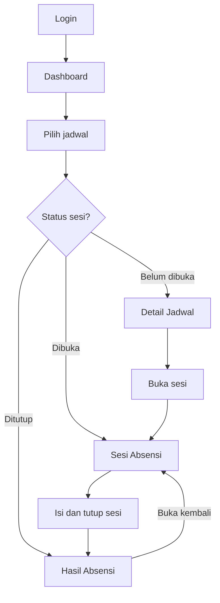
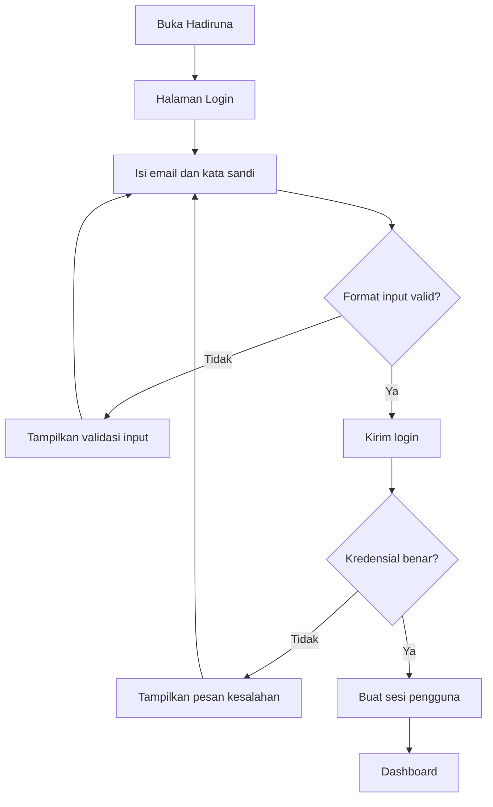
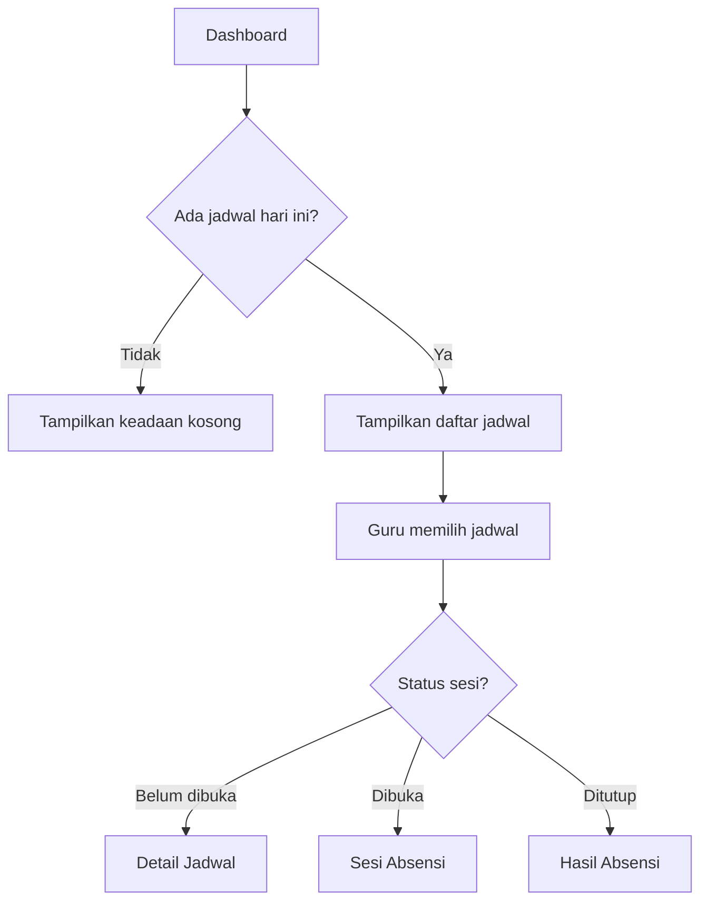
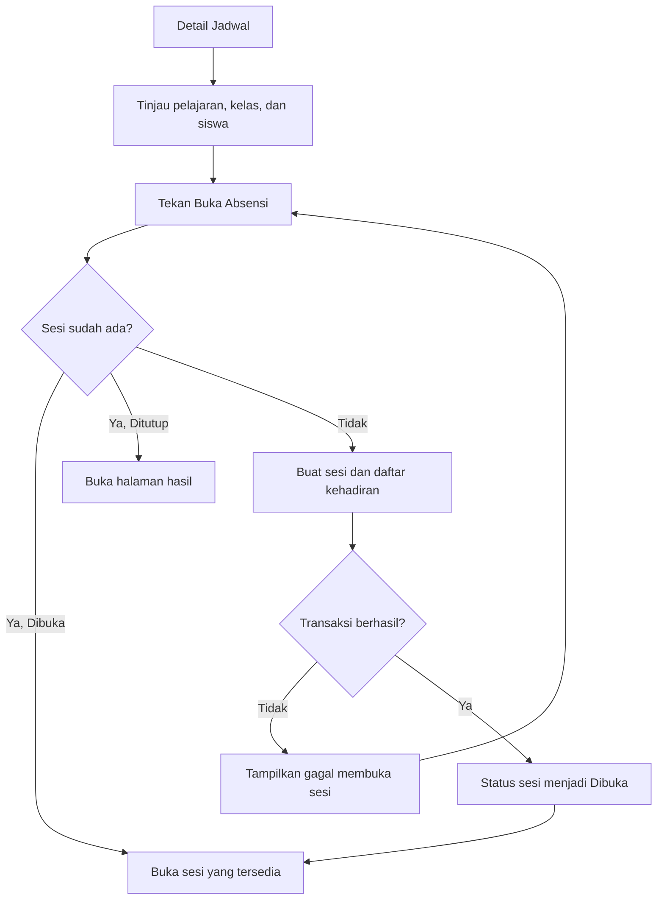
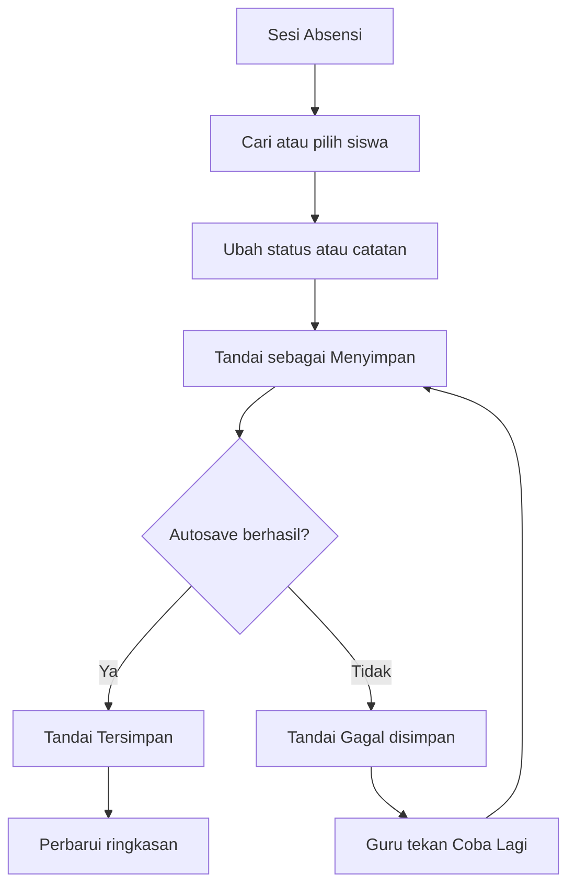
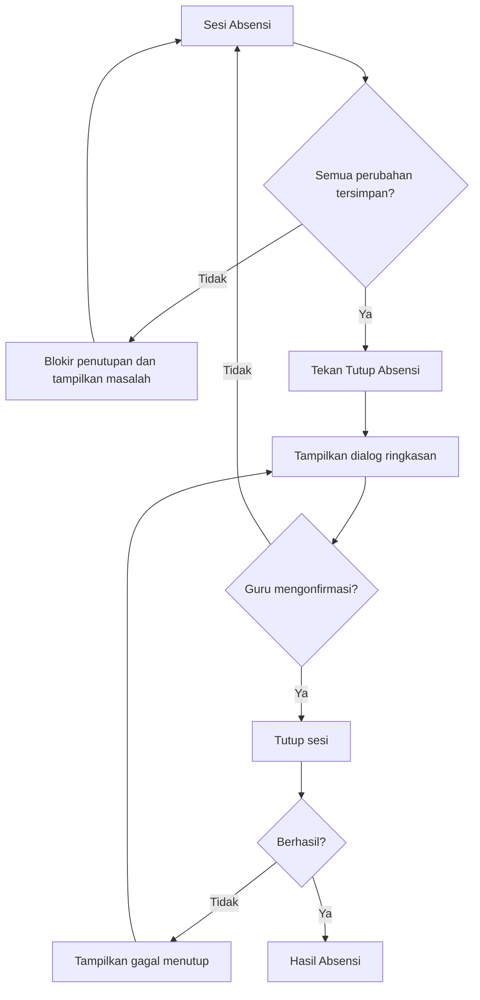
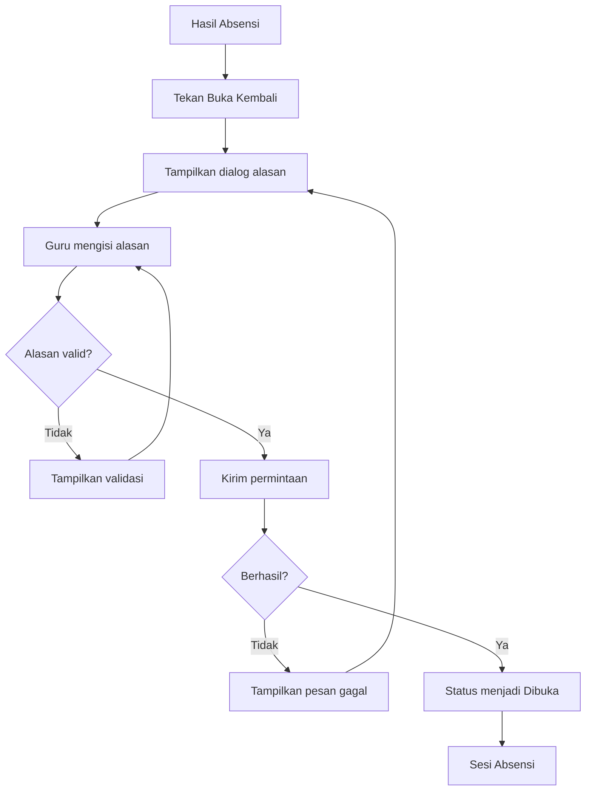
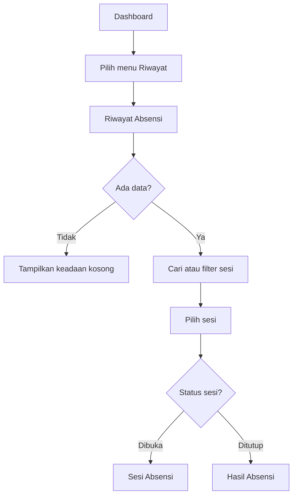
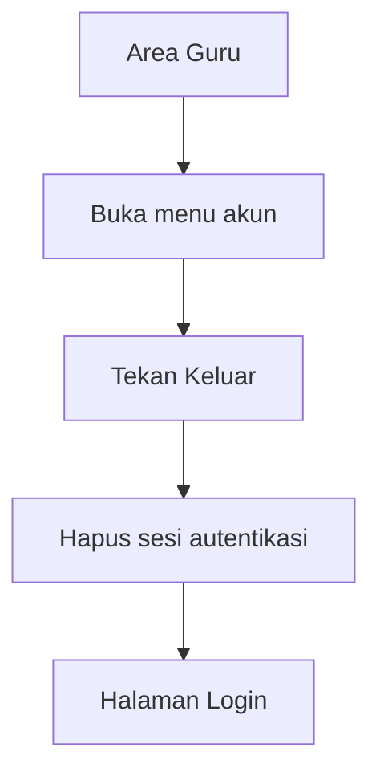
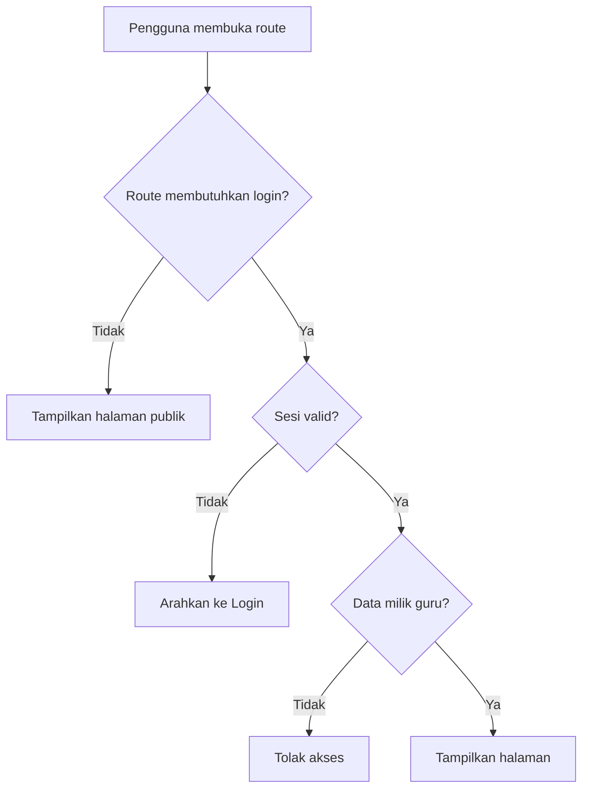

# User Flow Hadiruna

## Aplikasi Absensi Siswa untuk SMA Islam dan Madrasah Aliyah

| Informasi | Keterangan |
|---|---|
| Dokumen | User Flow |
| Produk | Hadiruna *(nama sementara)* |
| Aktor utama | Guru |
| Platform | Web responsif |
| Acuan | Mini PRD Hadiruna v1.0 dan Sitemap Hadiruna v1.0 |
| Versi dokumen | 1.0 |
| Tanggal | 8 September 2026 |

## 1. Tujuan Dokumen

Dokumen ini menjelaskan perjalanan guru ketika menggunakan prototype Hadiruna, mulai dari login hingga melakukan, menutup, melihat, dan membuka kembali absensi. Setiap alur memuat titik keputusan, perubahan status, hasil berhasil, dan kondisi gagal yang perlu ditangani oleh antarmuka maupun backend.

User flow tidak menambahkan aktor atau fitur di luar scope. Guru tetap menjadi satu-satunya pengguna, sedangkan data akun, jadwal, kelas, mata pelajaran, dan siswa tersedia melalui database seed.

## 2. Konvensi Alur

| Bentuk/istilah | Arti |
|---|---|
| Halaman | Route yang tercantum dalam Sitemap |
| Proses | Tindakan pengguna atau sistem |
| Keputusan | Kondisi yang menghasilkan lebih dari satu jalur |
| Berhasil | Tujuan alur tercapai |
| Gagal | Sistem menampilkan pesan dan memberikan tindakan pemulihan |

### Keputusan Penyimpanan

Pada Sesi Absensi, perubahan status atau catatan siswa disimpan secara otomatis. Antarmuka menampilkan tiga keadaan:

- **Menyimpan:** permintaan sedang diproses.
- **Tersimpan:** perubahan berhasil dicatat.
- **Gagal disimpan:** perubahan belum tercatat dan guru dapat mencoba kembali.

Guru tidak dapat menutup sesi selama masih ada perubahan yang sedang disimpan atau gagal disimpan.

## 3. Ringkasan User Flow

| ID | Nama Alur | Titik Awal | Hasil Akhir |
|---|---|---|---|
| UF-01 | Login Guru | Login | Dashboard |
| UF-02 | Memilih Jadwal | Dashboard | Detail, sesi, atau hasil absensi |
| UF-03 | Membuka Sesi | Detail Jadwal | Sesi Absensi berstatus Dibuka |
| UF-04 | Mengisi Kehadiran | Sesi Absensi | Perubahan kehadiran tersimpan |
| UF-05 | Menutup Sesi | Sesi Absensi | Hasil Absensi berstatus Ditutup |
| UF-06 | Membuka Kembali Sesi | Hasil Absensi | Sesi Absensi berstatus Dibuka |
| UF-07 | Melihat Riwayat | Dashboard/Riwayat | Sesi atau hasil yang dipilih |
| UF-08 | Logout | Menu Akun | Login |

## 4. Flow Utama Keseluruhan

Status sesi menentukan tujuan guru setelah memilih jadwal. Dengan pola ini, guru tidak perlu memahami route atau mencari tombol yang berbeda secara manual.

## 5. UF-01 — Login Guru

### Tujuan

Memverifikasi akun guru dan mengarahkan guru ke dashboard miliknya.

### Prasyarat

- Akun guru demo tersedia.
- Guru belum memiliki sesi login yang aktif.

### Alur

### Kondisi Berhasil

- Identitas guru tersimpan dalam sesi autentikasi.
- Guru diarahkan ke `/dashboard`.
- Dashboard hanya meminta data jadwal milik guru yang sedang login.

### Kondisi Gagal

| Kondisi | Respons Sistem | Tindakan Guru |
|---|---|---|
| Email tidak valid | Tandai input dan tampilkan pesan format email | Perbaiki email |
| Kata sandi kosong | Tandai input kata sandi | Isi kata sandi |
| Kredensial salah | Tampilkan pesan umum bahwa email atau kata sandi salah | Coba kembali |
| Server gagal dihubungi | Tampilkan pesan kegagalan dan tombol Coba Lagi | Kirim ulang login |

Pesan kredensial tidak menjelaskan apakah email atau kata sandi yang salah untuk mengurangi pengungkapan informasi akun.

## 6. UF-02 — Memilih Jadwal

### Tujuan

Mengarahkan guru ke halaman yang tepat berdasarkan status sesi absensi pada jadwal.

### Prasyarat

- Guru sudah login.
- Jadwal milik guru telah tersedia.

### Alur

### Aturan Tujuan

| Status | Label pada Dashboard | Halaman Tujuan |
|---|---|---|
| Belum Dibuka | Lihat Jadwal | `/schedules/:scheduleId` |
| Dibuka | Lanjutkan Absensi | `/attendance/:sessionId` |
| Ditutup | Lihat Hasil | `/attendance/:sessionId/result` |

### Kondisi Gagal

| Kondisi | Respons Sistem |
|---|---|
| Jadwal gagal dimuat | Tampilkan pesan dan tombol Muat Ulang |
| Jadwal tidak ditemukan | Tampilkan Halaman Tidak Ditemukan |
| Jadwal bukan milik guru | Tolak akses dan arahkan ke Dashboard |

## 7. UF-03 — Membuka Sesi Absensi

### Tujuan

Membuat satu sesi absensi untuk jadwal dan tanggal yang dipilih.

### Prasyarat

- Guru sudah login.
- Jadwal merupakan milik guru.
- Jadwal belum memiliki sesi pada tanggal tersebut.

### Alur

### Proses Sistem

Pembuatan sesi dan daftar kehadiran dilakukan dalam satu transaksi database:

1. memeriksa kepemilikan jadwal;
2. memeriksa sesi dengan kombinasi jadwal dan tanggal yang sama;
3. membuat sesi berstatus **Dibuka**;
4. mengambil seluruh siswa aktif dalam kelas;
5. membuat satu catatan untuk setiap siswa dengan status **Hadir**; dan
6. mencatat waktu pembukaan sesi.

Jika salah satu langkah gagal, seluruh operasi dibatalkan agar tidak menghasilkan sesi tanpa daftar siswa atau daftar siswa yang tidak lengkap.

### Kondisi Berhasil

- Tepat satu sesi dibuat.
- Semua siswa kelas tercantum satu kali.
- Semua siswa memperoleh status awal Hadir.
- Guru diarahkan ke `/attendance/:sessionId`.

### Kondisi Gagal

| Kondisi | Respons Sistem |
|---|---|
| Sesi telah dibuat oleh permintaan sebelumnya | Gunakan sesi yang sudah ada, jangan membuat duplikat |
| Daftar siswa kosong | Batalkan pembuatan dan tampilkan bahwa kelas belum memiliki siswa |
| Transaksi database gagal | Batalkan seluruh perubahan dan tampilkan tombol Coba Lagi |
| Guru bukan pemilik jadwal | Tolak akses dan arahkan ke Dashboard |

## 8. UF-04 — Mengisi Kehadiran

### Tujuan

Mencatat status kehadiran dengan cepat dan memastikan setiap perubahan benar-benar tersimpan.

### Prasyarat

- Sesi berstatus Dibuka.
- Guru merupakan pemilik jadwal.
- Daftar siswa berhasil dimuat.

### Alur Perubahan Status

### Status yang Tersedia

| Status | Penggunaan | Catatan |
|---|---|---|
| Hadir | Siswa mengikuti pelajaran | Status awal semua siswa |
| Izin | Siswa tidak hadir dengan izin | Catatan opsional |
| Sakit | Siswa tidak hadir karena sakit | Catatan opsional |
| Alpa | Siswa tidak hadir tanpa keterangan | Catatan opsional |
| Terlambat | Siswa hadir setelah waktu mulai | Catatan dapat memuat waktu/keterangan |

### Perilaku Antarmuka

- Ringkasan dihitung dari data terakhir yang berhasil tersimpan.
- Baris siswa yang gagal tersimpan memiliki penanda yang jelas.
- Pencarian tidak mengubah atau menghapus status siswa.
- Perubahan status langsung memicu autosave, sedangkan catatan disimpan setelah guru berhenti mengetik sejenak atau keluar dari input.
- Guru dapat mengubah status berkali-kali selama sesi masih Dibuka.
- Catatan kosong tetap diperbolehkan untuk seluruh status.
- Tombol Tutup Absensi dinonaktifkan saat penyimpanan berlangsung atau gagal.

### Kondisi Gagal

| Kondisi | Respons Sistem | Pemulihan |
|---|---|---|
| Perubahan gagal disimpan | Pertahankan pilihan di layar dan tampilkan Gagal disimpan | Coba Lagi |
| Sesi ternyata sudah Ditutup | Hentikan edit dan arahkan ke Hasil Absensi | Lihat hasil |
| Siswa tidak ditemukan dalam sesi | Batalkan perubahan dan muat ulang daftar | Muat Ulang |
| Akses guru tidak valid | Hentikan edit dan arahkan ke Dashboard | Login kembali bila perlu |

## 9. UF-05 — Menutup Sesi Absensi

### Tujuan

Mengonfirmasi hasil absensi dan mengunci sesi dari perubahan langsung.

### Prasyarat

- Sesi berstatus Dibuka.
- Tidak ada perubahan yang sedang atau gagal disimpan.
- Guru merupakan pemilik jadwal.

### Alur

### Isi Dialog Konfirmasi

- jumlah seluruh siswa;
- jumlah Hadir, Izin, Sakit, Alpa, dan Terlambat;
- peringatan bahwa data akan dikunci;
- tombol **Batal**; dan
- tombol **Ya, Tutup Absensi**.

### Proses Sistem

1. memverifikasi guru sebagai pemilik sesi;
2. memastikan status terkini masih Dibuka;
3. memastikan seluruh siswa memiliki tepat satu catatan;
4. menghitung ringkasan dari database;
5. mengubah status menjadi Ditutup; dan
6. mencatat waktu penutupan.

### Kondisi Berhasil

- Sesi berstatus Ditutup.
- Data tidak dapat diedit langsung.
- Guru diarahkan ke `/attendance/:sessionId/result`.

### Kondisi Gagal

- Dialog tetap terbuka atau guru dikembalikan ke sesi.
- Data sesi tetap berstatus Dibuka.
- Sistem menampilkan pesan yang dapat ditindaklanjuti.
- Guru dapat mencoba menutup kembali tanpa kehilangan perubahan tersimpan.

## 10. UF-06 — Membuka Kembali Sesi

### Tujuan

Memungkinkan koreksi data setelah penutupan dengan alasan dan waktu perubahan yang tercatat.

### Prasyarat

- Sesi berstatus Ditutup.
- Guru merupakan pemilik jadwal.

### Alur

### Validasi Alasan

- wajib diisi;
- tidak boleh hanya berisi spasi;
- menggunakan batas panjang yang wajar, misalnya 10–250 karakter; dan
- divalidasi pada frontend dan backend.

### Proses Sistem

1. memverifikasi kepemilikan sesi;
2. memastikan status terkini masih Ditutup;
3. menyimpan alasan pembukaan kembali;
4. menyimpan waktu pembukaan kembali; dan
5. mengubah status menjadi Dibuka.

### Kondisi Berhasil

- Catatan kehadiran sebelumnya tetap tersedia.
- Sesi dapat diedit kembali.
- Guru diarahkan ke `/attendance/:sessionId`.
- Alasan dan waktu perubahan muncul pada hasil setelah sesi ditutup kembali.

### Kondisi Gagal

| Kondisi | Respons Sistem |
|---|---|
| Alasan kosong atau terlalu pendek | Tampilkan validasi di bawah input |
| Sesi ternyata sudah Dibuka | Arahkan ke Sesi Absensi yang tersedia |
| Guru bukan pemilik sesi | Tolak akses dan arahkan ke Dashboard |
| Server gagal menyimpan perubahan | Pertahankan alasan dan berikan tombol Coba Lagi |

## 11. UF-07 — Melihat Riwayat Absensi

### Tujuan

Membantu guru menemukan sesi sebelumnya dan melanjutkan tindakan sesuai statusnya.

### Alur

### Kondisi Gagal

- Jika data gagal dimuat, tampilkan tombol **Muat Ulang**.
- Jika sesi tidak ditemukan, tampilkan Halaman Tidak Ditemukan.
- Jika kepemilikan sesi tidak valid, tolak akses dan arahkan ke Dashboard.

## 12. UF-08 — Logout

### Tujuan

Mengakhiri sesi autentikasi guru dengan aman.

### Alur

Jika penghapusan sesi pada server gagal, aplikasi tetap menampilkan pesan kesalahan dan tidak memberikan kesan bahwa logout telah berhasil.

## 13. Alur Proteksi Route

Backend harus memeriksa autentikasi dan kepemilikan data pada setiap permintaan yang mengakses jadwal atau sesi. Proteksi frontend hanya membantu navigasi dan tidak boleh menjadi satu-satunya pengamanan.

## 14. Matriks Transisi Status Sesi

| Status Awal | Tindakan | Status Akhir | Diizinkan | Catatan |
|---|---|---|---|---|
| Belum Dibuka | Buka Absensi | Dibuka | Ya | Membuat sesi dan catatan awal |
| Belum Dibuka | Tutup Absensi | — | Tidak | Belum ada sesi |
| Dibuka | Ubah Kehadiran | Dibuka | Ya | Disimpan otomatis |
| Dibuka | Tutup Absensi | Ditutup | Ya | Membutuhkan konfirmasi |
| Dibuka | Buka Kembali | — | Tidak | Sesi sudah dapat diedit |
| Ditutup | Ubah Kehadiran | — | Tidak | Harus dibuka kembali |
| Ditutup | Tutup Absensi | — | Tidak | Sesi sudah ditutup |
| Ditutup | Buka Kembali | Dibuka | Ya | Alasan wajib diisi |

## 15. Pemetaan Flow ke Halaman

| User Flow | Login | Dashboard | Detail Jadwal | Sesi Absensi | Hasil Absensi | Riwayat |
|---|---:|---:|---:|---:|---:|---:|
| UF-01 Login Guru | ✓ | ✓ |  |  |  |  |
| UF-02 Memilih Jadwal |  | ✓ | ✓ | ✓ | ✓ |  |
| UF-03 Membuka Sesi |  |  | ✓ | ✓ |  |  |
| UF-04 Mengisi Kehadiran |  |  |  | ✓ |  |  |
| UF-05 Menutup Sesi |  |  |  | ✓ | ✓ |  |
| UF-06 Membuka Kembali |  |  |  | ✓ | ✓ |  |
| UF-07 Melihat Riwayat |  | ✓ |  | ✓ | ✓ | ✓ |
| UF-08 Logout | ✓ | ✓ | ✓ | ✓ | ✓ | ✓ |

## 16. Pemetaan Flow ke Aturan Bisnis

| User Flow | Aturan PRD yang Utama |
|---|---|
| UF-01 | Autentikasi dan akses area guru |
| UF-02 | BR-01, BR-13 |
| UF-03 | BR-01, BR-02, BR-03, BR-04, BR-05, BR-10 |
| UF-04 | BR-05, BR-06, BR-07, BR-08, BR-12 |
| UF-05 | BR-08, BR-10, BR-12 |
| UF-06 | BR-08, BR-09, BR-10, BR-11 |
| UF-07 | BR-01, BR-08 |
| UF-08 | Autentikasi dan pengakhiran sesi |

## 17. Prioritas Implementasi Flow

| Prioritas | User Flow | Alasan |
|---|---|---|
| P0 | UF-01 Login Guru | Syarat akses seluruh aplikasi |
| P0 | UF-02 Memilih Jadwal | Pintu masuk proses absensi |
| P0 | UF-03 Membuka Sesi | Membentuk sesi dan daftar siswa |
| P0 | UF-04 Mengisi Kehadiran | Nilai utama produk |
| P0 | UF-05 Menutup Sesi | Menyelesaikan siklus absensi |
| P1 | UF-06 Membuka Kembali | Menunjukkan koreksi yang terkendali |
| P1 | UF-07 Melihat Riwayat | Memudahkan akses sesi lama |
| P1 | UF-08 Logout | Melengkapi autentikasi |

Seluruh flow tetap termasuk scope prototype. Prioritas digunakan untuk menentukan urutan pengerjaan, bukan untuk menghapus flow P1.

## 18. Checklist Validasi User Flow

- [ ] Guru dapat menyelesaikan alur utama tanpa masuk ke halaman yang tidak diperlukan.
- [ ] Setiap status sesi mengarahkan guru ke halaman yang tepat.
- [ ] Sesi tidak dapat dibuat dua kali untuk jadwal dan tanggal yang sama.
- [ ] Semua siswa memperoleh status Hadir ketika sesi pertama kali dibuka.
- [ ] Perubahan menunjukkan status Menyimpan, Tersimpan, atau Gagal disimpan.
- [ ] Penutupan diblokir jika masih ada perubahan yang belum tersimpan.
- [ ] Ringkasan konfirmasi berasal dari data yang berhasil tersimpan.
- [ ] Sesi Ditutup tidak dapat diedit secara langsung.
- [ ] Pembukaan kembali membutuhkan alasan yang valid.
- [ ] Guru tidak dapat mengakses jadwal atau sesi milik guru lain.
- [ ] Kondisi loading, kosong, gagal, dan tidak berwenang memiliki jalan pemulihan.
- [ ] Tombol kembali atau batal selalu memiliki tujuan yang jelas.
- [ ] Alur utama dapat didemonstrasikan dalam waktu 3–5 menit.

## 19. Handoff ke Dokumen Berikutnya

User Flow ini menjadi acuan untuk:

1. menentukan komponen, keadaan, dan umpan balik pada UI Style Guide;
2. menentukan entitas, constraint, dan transaksi pada Database Schema/ERD;
3. menentukan endpoint, payload, respons, dan error pada API Contract; dan
4. menyusun test case untuk setiap jalur berhasil dan gagal.

---

Alur inti Hadiruna adalah: guru masuk, memilih jadwal, membuka sesi, memperbarui kehadiran dengan autosave, menutup sesi, dan membuka kembali hanya ketika koreksi diperlukan. Seluruh alur mempertahankan scope prototype sekaligus menjawab kondisi lapangan yang paling penting.
