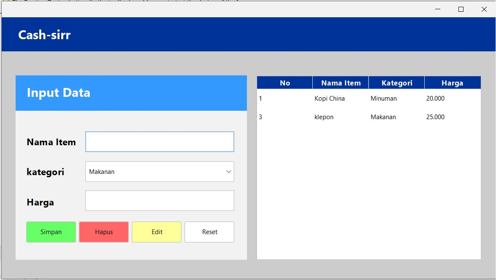

# Aplikasi Kasir (Cash-sirr) 🛒



Proyek ini adalah aplikasi desktop sederhana berbasis **Java Swing** untuk manajemen data barang/item kasir. Aplikasi ini mengimplementasikan konsep Pemrograman Berbasis Objek (PBO) dan memiliki fitur CRUD (Create, Read, Update, Delete) yang terhubung langsung dengan database MySQL.

Aplikasi ini dikembangkan sebagai pemenuhan Tugas Mata Kuliah Pemrograman Berbasis Objek, Program Studi Teknik Informatika, Universitas Teknologi Bandung.

## 🚀 Fitur Utama

- **Create:** Menambahkan data item baru (Nama Item, Kategori, Harga) ke dalam database.
- **Read:** Menampilkan daftar item secara real-time pada komponen `JTable`.
- **Update:** Mengubah data item yang sudah ada. Dilengkapi dengan deteksi perubahan data untuk mencegah update yang tidak perlu.
- **Delete:** Menghapus data item dari database beserta pop-up konfirmasi yang menampilkan nama item.
- **UI Modern:** Menggunakan library **FlatLaf** untuk antarmuka pengguna (GUI) yang lebih bersih dan modern dibandingkan tema bawaan Java.
- **Pencegahan Duplikasi:** Tombol simpan dinonaktifkan secara otomatis ketika baris tabel diklik untuk mencegah pengguna menyimpan data yang sama secara tidak sengaja.

## 🛠️ Teknologi & Tools yang Digunakan

- **Bahasa Pemrograman:** Java (JDK 25)
- **GUI Component:** Java Swing
- **Database:** MySQL
- **Database Driver:** `mysql-connector-java-5.1.46` (JDBC)
- **UI Theme:** FlatLaf 3.6.1
- **IDE/Editor:** Apache NetBeans / Visual Studio Code

## 📁 Struktur Proyek

Berdasarkan arsitektur yang digunakan, berikut adalah direktori utama dari proyek ini:

```text
KASIR_APP/
├── img/            # Direktori aset gambar (cash-sir.jpg)
├── src/            # Kode sumber (Source code) aplikasi
│   ├── config/     # Package konfigurasi (Koneksi.java)
│   └── kasir_app/  # Package utama (Frame.java, Kasir_app.java, ThemeManager.java)
├── Libraries/      # Library eksternal (FlatLaf & MySQL Connector)
└── readme.md       # Dokumentasi proyek
```

# ⚙️ Cara Menjalankan Aplikasi

## 1. Persiapan Database
1. Pastikan server MySQL (XAMPP) sudah berjalan.
2. Buat database dengan nama db_kasir.
3. Eksekusi query berikut untuk membuat tabel:

```sql
CREATE TABLE items (
    No INT(5) NOT NULL AUTO_INCREMENT,
    nama_item VARCHAR(50) NOT NULL,
    kategori VARCHAR(50) NOT NULL,
    harga VARCHAR(20) NOT NULL,
    PRIMARY KEY (No)
);
```

## 2. Konfigurasi & Run
1. Buka proyek melalui IDE pilihan Anda.
2. Pastikan file .jar di folder Libraries sudah masuk ke Libraries proyek.
3. Jalankan Kasir_app.java sebagai Main Class.
